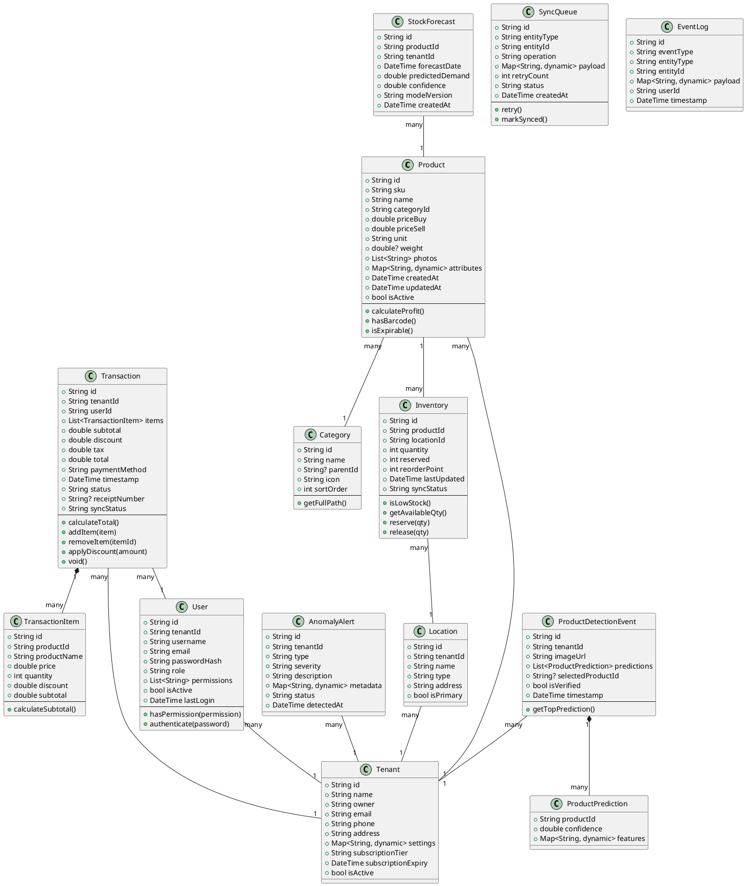
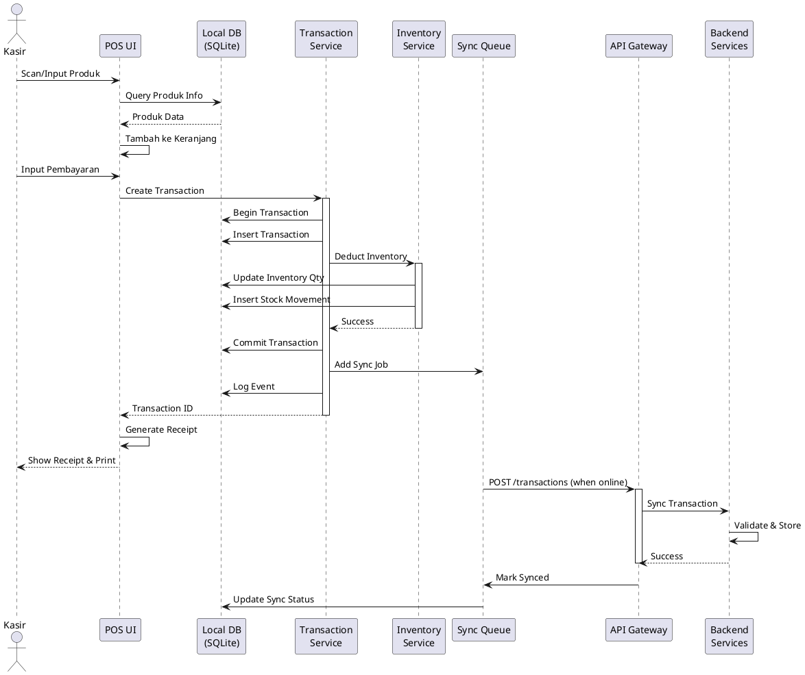
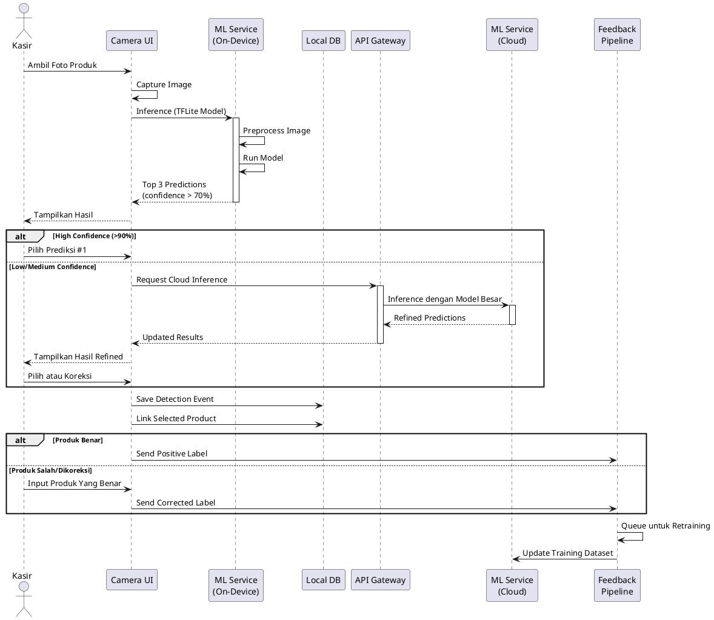
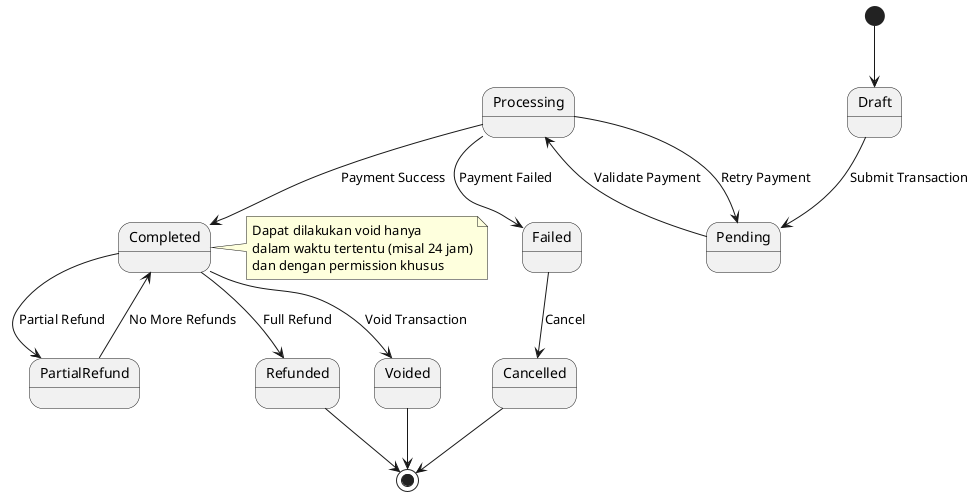
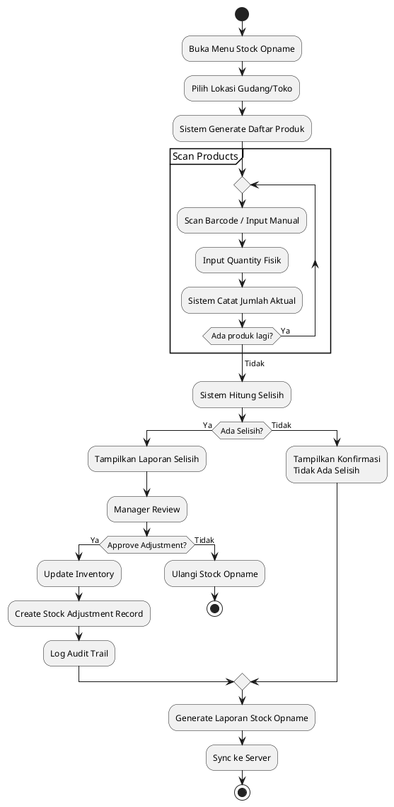
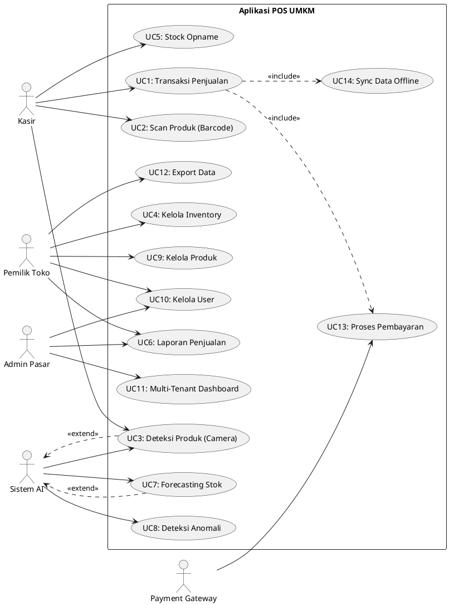

# UML Diagrams - Aplikasi POS UMKM

## 1. Class Diagram - Domain Model

## 2. Sequence Diagram - Transaksi POS

## 3. Sequence Diagram - Deteksi Produk AI

## 4. Component Diagram - System Architecture

```plantuml
@startuml

package "Mobile Client (Flutter/Android)" {
  [POS UI]
  [Camera Module]
  [Offline Storage\nSQLite]
  [Sync Manager]
  [ML Inference\nTFLite]
  [Receipt Printer]
  [Hardware Integration]
}

package "API Layer" {
  [API Gateway]
  [Auth Service]
  [Rate Limiter]
  [Load Balancer]
}

package "Core Services" {
  [Transaction Service]
  [Inventory Service]
  [Product Catalog Service]
  [Tenant Management]
  [User Management]
  [Reporting Service]
}

package "AI/ML Services" {
  [Vision Service\nProduct Detection]
  [Forecasting Service]
  [Anomaly Detection]
  [Model Training Pipeline]
  [Feature Store]
}

package "Integration Services" {
  [Payment Gateway\nQRIS/E-Wallet]
  [Notification Service\nSMS/WhatsApp]
  [Sync Service]
  [Export Service]
}

package "Data Layer" {
  database "PostgreSQL\nPrimary DB" as PG
  database "Redis\nCache" as Redis
  database "ElasticSearch\nSearch & Analytics" as ES
  queue "Kafka\nEvent Stream" as Kafka
  storage "S3\nObject Storage" as S3
}

package "DevOps & Monitoring" {
  [CI/CD Pipeline]
  [Monitoring\nPrometheus/Grafana]
  [Log Aggregation\nELK]
  [Backup Service]
}

[POS UI] --> [Offline Storage\nSQLite]
[POS UI] --> [Camera Module]
[POS UI] --> [ML Inference\nTFLite]
[POS UI] --> [Sync Manager]
[Sync Manager] --> [API Gateway]
[Hardware Integration] --> [Receipt Printer]

[API Gateway] --> [Auth Service]
[API Gateway] --> [Core Services]
[API Gateway] --> [AI/ML Services]
[API Gateway] --> [Integration Services]

[Core Services] --> PG
[Core Services] --> Redis
[Core Services] --> Kafka
[AI/ML Services] --> S3
[AI/ML Services] --> [Feature Store]
[Reporting Service] --> ES

[Sync Service] --> [Offline Storage\nSQLite]
[Sync Service] --> PG

Kafka --> [Model Training Pipeline]
[Model Training Pipeline] --> [ML Inference\nTFLite]

@enduml
```

## 5. State Diagram - Transaction Status

## 6. Activity Diagram - Stock Opname

## 7. Use Case Diagram

## Cara Menggunakan Diagram

1. **PlantUML**: Copy kode diagram ke editor PlantUML online (http://www.plantuml.com/plantuml/uml/) atau gunakan plugin IDE
2. **Mermaid**: Alternatif lain, bisa convert ke Mermaid syntax untuk GitHub/GitLab native rendering
3. **Export**: Export sebagai PNG/SVG untuk dokumentasi

## Tools yang Direkomendasikan

- PlantUML Online Editor
- Visual Studio Code + PlantUML Extension
- Draw.io / Lucidchart (untuk editing lebih visual)
- Enterprise Architect / StarUML (untuk proyek besar)

