# Flow Diagrams - Aplikasi POS UMKM

## Overview
Dokumen ini berisi flow diagram untuk semua user journey utama dalam aplikasi POS.

---

## 1. LOGIN FLOW

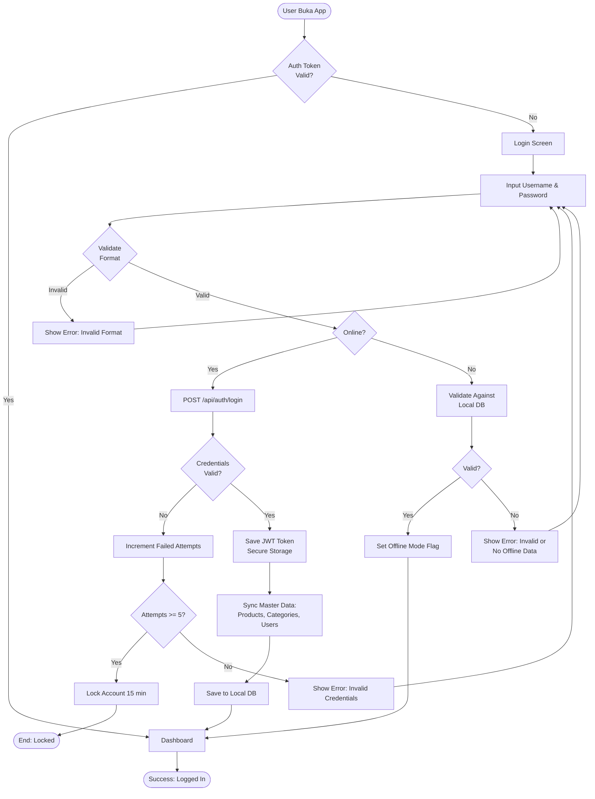

---

## 2. TRANSACTION FLOW (Happy Path)

```mermaid
flowchart TD
    Start([Kasir: Mulai Transaksi]) --> Dashboard[POS Dashboard]
    Dashboard --> NewTx[Tap: New Transaction]
    NewTx --> EmptyCart[Initialize Empty Cart]
    
    EmptyCart --> AddProduct{Tambah Produk}
    
    AddProduct -->|Scan Barcode| ScanBarcode[Scan Barcode]
    ScanBarcode --> FindProduct1[Query Product by Barcode]
    FindProduct1 --> ProductFound1{Found?}
    ProductFound1 -->|Yes| AddToCart1[Add to Cart]
    ProductFound1 -->|No| ShowError1[Show Error: Product Not Found]
    ShowError1 --> AddProduct
    
    AddProduct -->|Search Manual| SearchProduct[Search by Name/SKU]
    SearchProduct --> ShowResults[Show Product List]
    ShowResults --> SelectProduct[Select Product]
    SelectProduct --> AddToCart1
    
    AddProduct -->|Scan Camera| CameraDetection[Product Detection Flow]
    CameraDetection --> AddToCart1
    
    AddToCart1 --> CheckStock{Stock\nAvailable?}
    CheckStock -->|No| ShowError2[Show Error: Out of Stock]
    ShowError2 --> AddProduct
    CheckStock -->|Yes| AddToCart2[Add to Cart with Qty]
    
    AddToCart2 --> UpdateCart[Update Cart Display]
    UpdateCart --> MoreProducts{Tambah\nProduk Lagi?}
    MoreProducts -->|Yes| AddProduct
    
    MoreProducts -->|No| ShowSummary[Show Transaction Summary:\nSubtotal, Items Count]
    ShowSummary --> ApplyDiscount{Apply\nDiscount?}
    
    ApplyDiscount -->|Yes| InputDiscount[Input Discount %/Nominal]
    InputDiscount --> ValidateDiscount{Valid?}
    ValidateDiscount -->|No| ShowError3[Show Error]
    ShowError3 --> InputDiscount
    ValidateDiscount -->|Yes| RecalculateTotal[Recalculate Total]
    
    ApplyDiscount -->|No| RecalculateTotal
    RecalculateTotal --> ShowFinalTotal[Show Final Total]
    
    ShowFinalTotal --> SelectPayment[Select Payment Method]
    SelectPayment --> PaymentMethod{Payment\nMethod}
    
    PaymentMethod -->|Cash| InputCash[Input Amount Paid]
    InputCash --> CalculateChange[Calculate Change]
    CalculateChange --> ShowChange[Show Change Amount]
    ShowChange --> ConfirmPayment
    
    PaymentMethod -->|QRIS| GenerateQRIS[Generate QRIS Code]
    GenerateQRIS --> WaitPayment[Wait Payment Confirmation]
    WaitPayment --> PaymentStatus{Payment\nSuccess?}
    PaymentStatus -->|No| ShowError4[Show Error: Payment Failed]
    ShowError4 --> SelectPayment
    PaymentStatus -->|Yes| ConfirmPayment
    
    PaymentMethod -->|E-Wallet| ProcessEwallet[Process E-Wallet]
    ProcessEwallet --> ConfirmPayment
    
    ConfirmPayment[Confirm Transaction] --> SaveTransaction[BEGIN Transaction]
    SaveTransaction --> InsertTx[Insert to transactions table]
    InsertTx --> InsertItems[Insert transaction_items]
    InsertItems --> UpdateInventory[Update inventory qty]
    UpdateInventory --> InsertMovement[Insert stock_movements]
    InsertMovement --> AddSyncQueue[Add to sync_queue]
    AddSyncQueue --> LogEvent[Insert event_logs]
    LogEvent --> CommitTx[COMMIT Transaction]
    
    CommitTx --> GenerateReceipt[Generate Receipt]
    GenerateReceipt --> PrintReceipt[Print Receipt]
    PrintReceipt --> ShowSuccess[Show Success Message]
    
    ShowSuccess --> NextAction{Next\nAction?}
    NextAction -->|New Transaction| NewTx
    NextAction -->|Dashboard| Dashboard
    NextAction --> End([End])
```

---

## 3. PRODUCT DETECTION (AI) FLOW

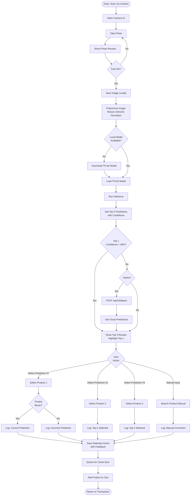

---

## 4. OFFLINE SYNC FLOW

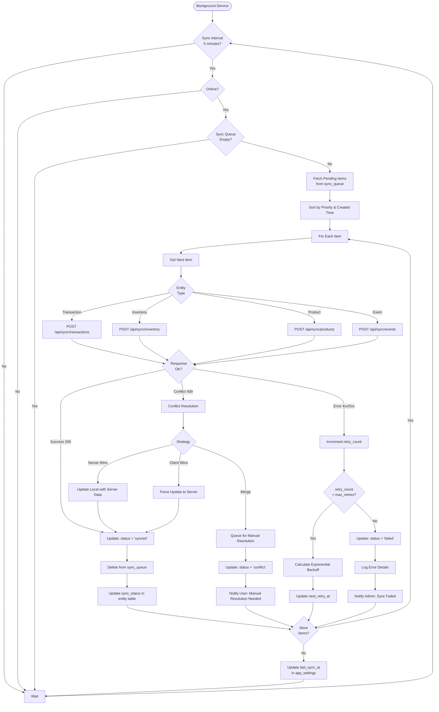

---

## 5. STOCK OPNAME FLOW

```mermaid
flowchart TD
    Start([Manager: Stock Opname]) --> SelectLocation[Select Location]
    SelectLocation --> GenerateList[Generate Product List\nfrom Inventory]
    GenerateList --> ShowList[Show Product List:\nExpected Qty]
    
    ShowList --> StartOpname[Start Stock Opname]
    StartOpname --> ScanLoop{Scan\nProducts}
    
    ScanLoop --> ScanProduct[Scan Product\nBarcode/QR]
    ScanProduct --> FindProduct{Product\nFound?}
    
    FindProduct -->|No| ShowError[Show Error]
    ShowError --> ScanLoop
    
    FindProduct -->|Yes| InputActualQty[Input Actual Quantity]
    InputActualQty --> ShowExpected[Show:\nExpected vs Actual]
    ShowExpected --> CalculateDiff[Calculate Difference]
    CalculateDiff --> MarkScanned[Mark Product as Scanned]
    
    MarkScanned --> MoreProducts{More\nProducts?}
    MoreProducts -->|Yes| ScanLoop
    
    MoreProducts -->|No| ShowUnscanned{Products\nNot Scanned?}
    ShowUnscanned -->|Yes| ShowWarning[Show Warning:\nUnscanned Products]
    ShowWarning --> ConfirmContinue{Continue?}
    ConfirmContinue -->|No| ScanLoop
    
    ShowUnscanned -->|No| GenerateSummary
    ConfirmContinue -->|Yes| GenerateSummary
    
    GenerateSummary[Generate Summary Report] --> ShowDifferences[Show Differences:\n+ Surplus\n- Shortage]
    
    ShowDifferences --> CheckDiff{Ada\nSelisih?}
    CheckDiff -->|No| ConfirmNoChange[Confirm: No Changes]
    ConfirmNoChange --> SaveOpname[Save Stock Opname Record]
    SaveOpname --> End([End])
    
    CheckDiff -->|Yes| ReviewDiff[Manager Review Differences]
    ReviewDiff --> ApprovalDecision{Approve\nAdjustment?}
    
    ApprovalDecision -->|No| CancelOpname{Cancel or\nRe-scan?}
    CancelOpname -->|Cancel| End
    CancelOpname -->|Re-scan| ScanLoop
    
    ApprovalDecision -->|Yes| BeginAdjustment[BEGIN Transaction]
    BeginAdjustment --> AdjustLoop[For Each Difference]
    
    AdjustLoop --> UpdateInventory[Update inventory.quantity]
    UpdateInventory --> InsertMovement[Insert stock_movements\ntype: ADJUSTMENT]
    InsertMovement --> MoreAdjust{More?}
    
    MoreAdjust -->|Yes| AdjustLoop
    MoreAdjust -->|No| SaveOpnameRecord[Insert Stock Opname Record]
    SaveOpnameRecord --> LogAudit[Insert audit_logs]
    LogAudit --> CommitTx[COMMIT Transaction]
    
    CommitTx --> AddSyncQueue[Add to sync_queue]
    AddSyncQueue --> GenerateReport[Generate PDF Report]
    GenerateReport --> ShowSuccess[Show Success:\nStock Updated]
    ShowSuccess --> End
```

---

## 6. LOW STOCK ALERT FLOW

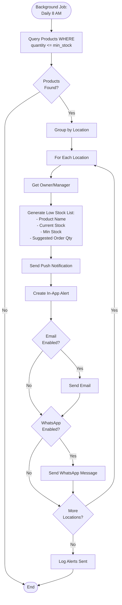

---

## 7. RETURN/REFUND FLOW

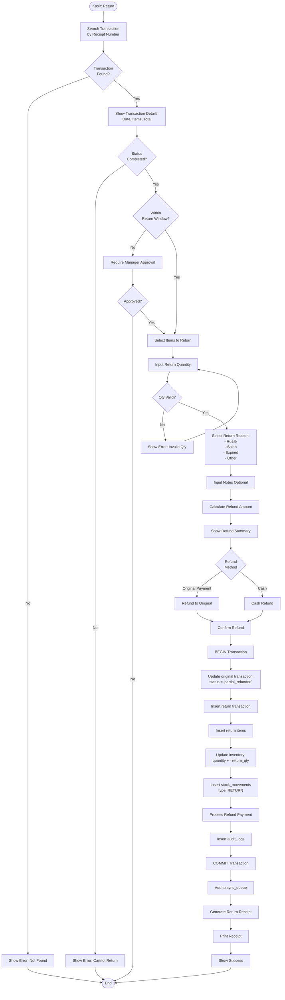

---

## 8. DATA SYNC CONFLICT RESOLUTION

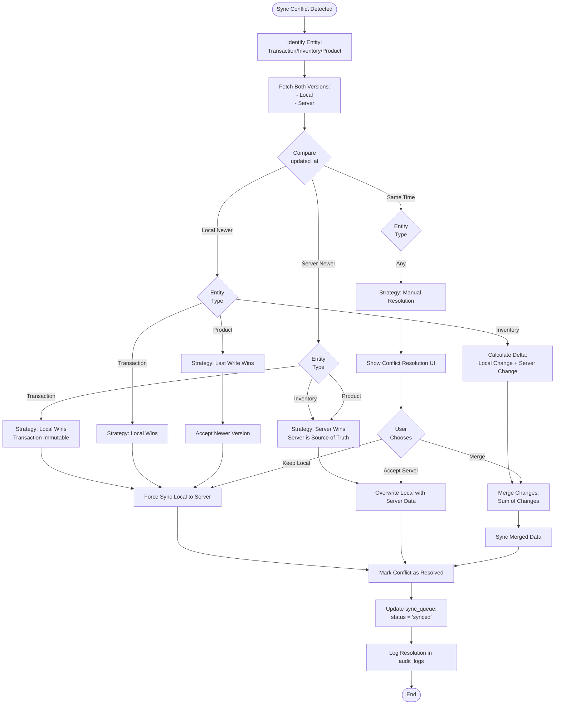

---

## 9. PAYMENT GATEWAY INTEGRATION (QRIS)

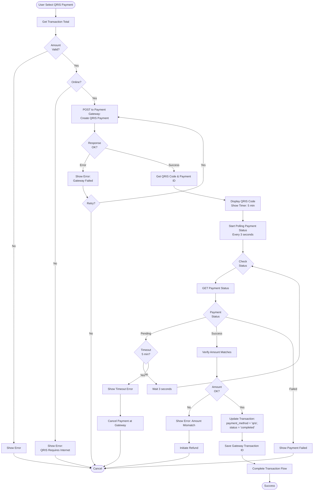

---

## 10. ADMIN MULTI-TENANT DASHBOARD

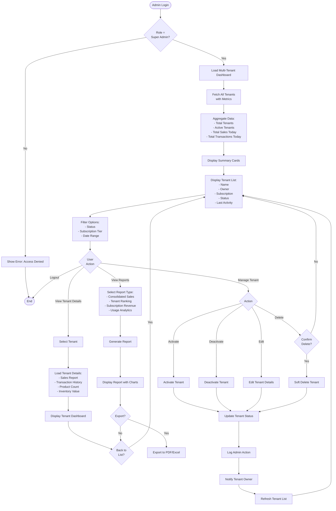

---

## 11. MODEL UPDATE (OTA) FLOW

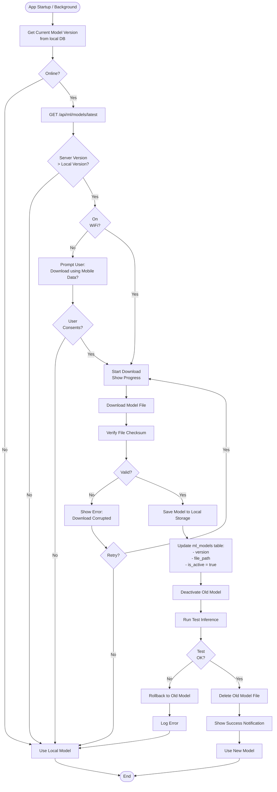

---

## Summary

Semua flow diagram di atas menggambarkan user journey dan system flow untuk:

1. **Login Flow** - Authentication offline & online
2. **Transaction Flow** - Happy path dari scan produk sampai print receipt
3. **Product Detection** - AI-based product recognition dengan feedback
4. **Offline Sync** - Background sync dengan conflict resolution
5. **Stock Opname** - Inventory audit process
6. **Low Stock Alert** - Automated notification system
7. **Return/Refund** - Return process dengan approval
8. **Conflict Resolution** - Strategi resolve sync conflicts
9. **QRIS Payment** - Payment gateway integration
10. **Admin Dashboard** - Multi-tenant management
11. **Model Update** - OTA update untuk ML models

Setiap flow sudah include:
- ✅ Happy path & error handling
- ✅ Offline/online scenarios
- ✅ Validation steps
- ✅ Database transactions
- ✅ Sync queue management
- ✅ User feedback & notifications

