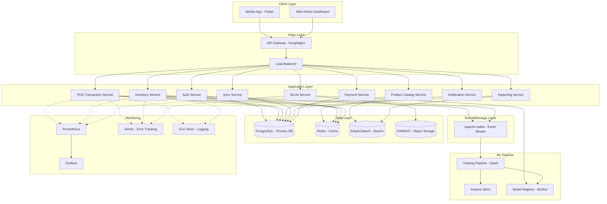
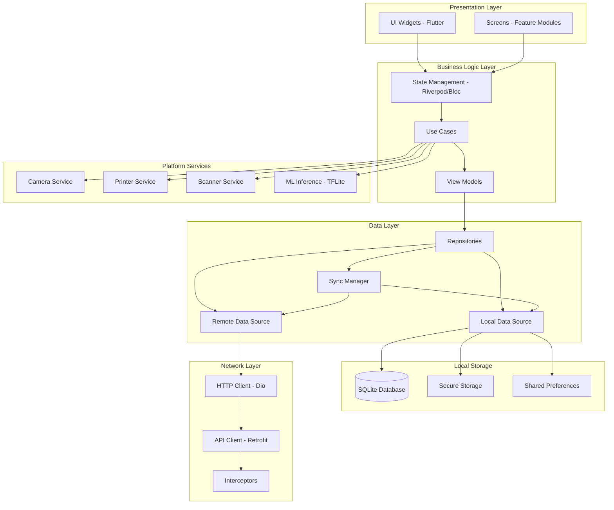
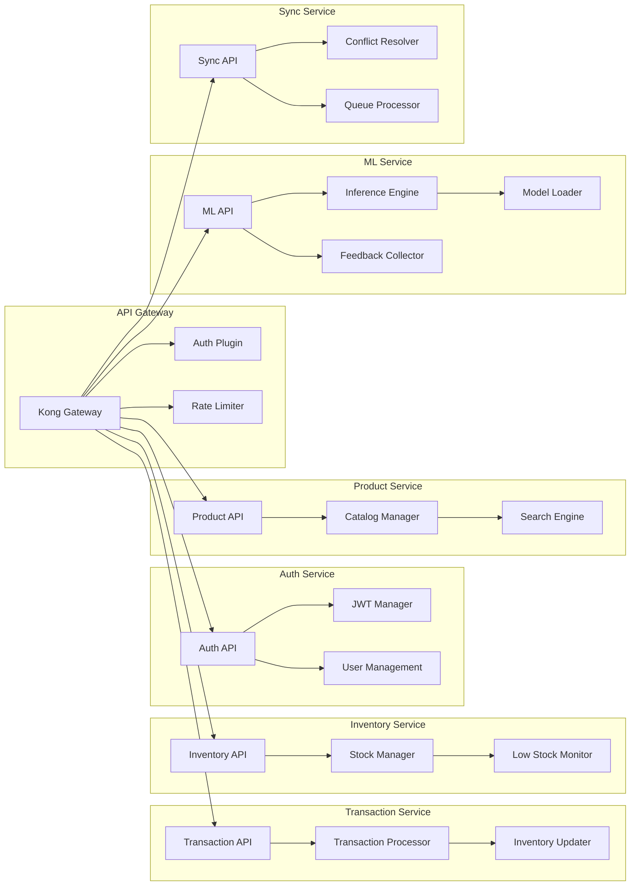
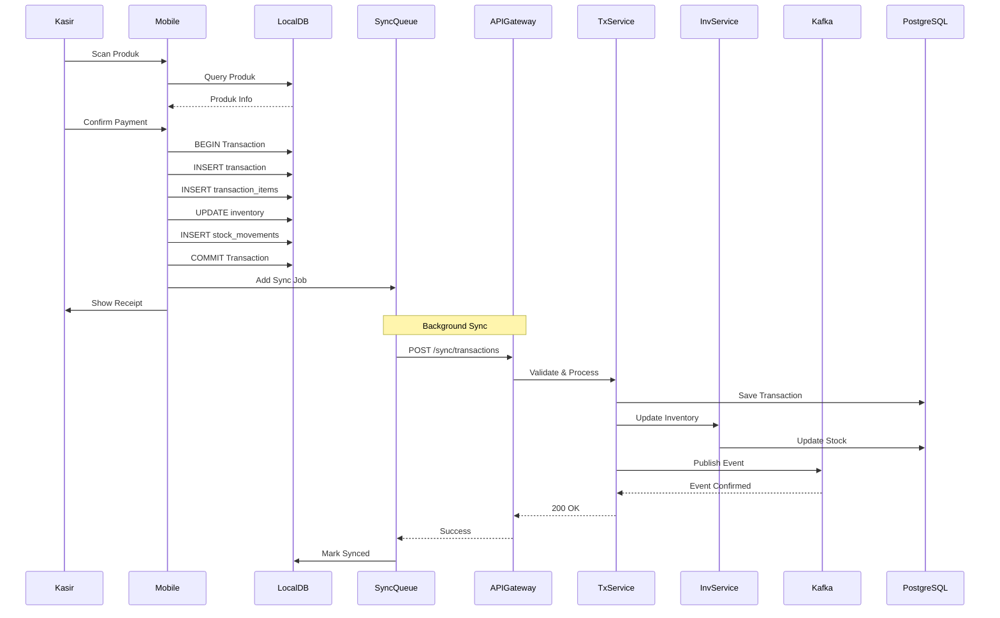
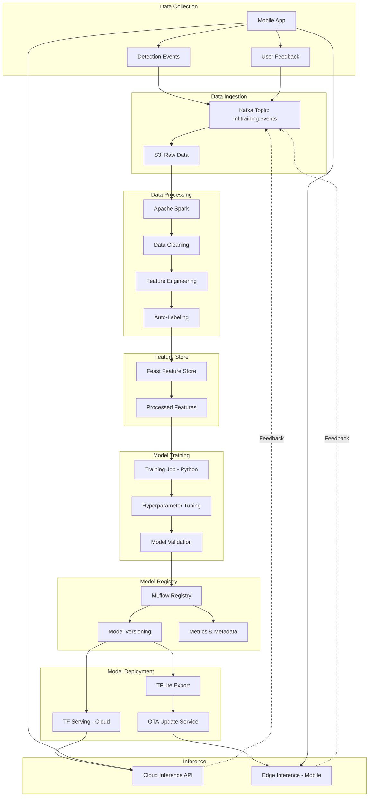
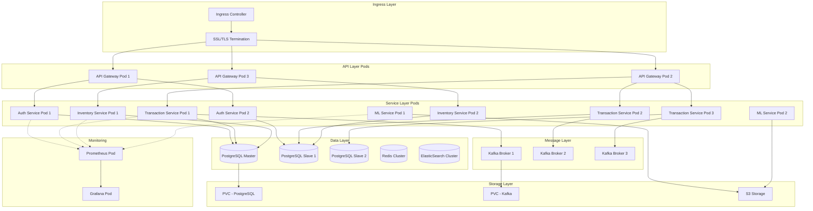
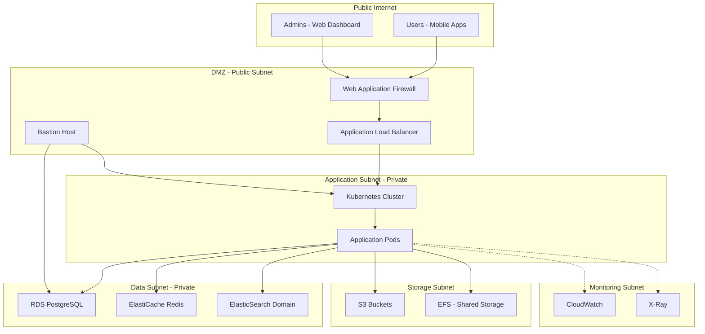
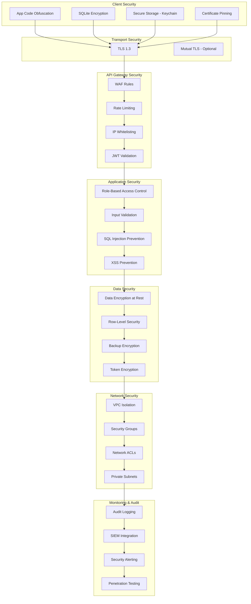
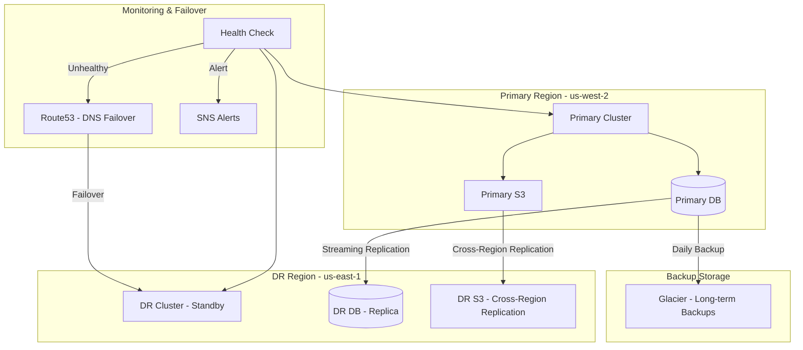

# Architecture Diagrams - Aplikasi POS UMKM

## 1. High-Level System Architecture

---

## 2. Mobile App Architecture

---

## 3. Backend Microservices Architecture

---

## 4. Data Flow Architecture (Transaction)

---

## 5. ML Pipeline Architecture

---

## 6. Deployment Architecture (Kubernetes)

---

## 7. Network Architecture

---

## 8. Security Architecture

---

## 9. Disaster Recovery Architecture

---

## 10. CI/CD Pipeline Architecture

```mermaid
graph LR
    subgraph "Source Control"
        GitHub[GitHub Repository]
        Branch[Feature Branch]
    end
    
    subgraph "CI Pipeline"
        Trigger[Push Trigger]
        Lint[Linting]
        UnitTest[Unit Tests]
        IntegrationTest[Integration Tests]
        Build[Build]
        Scan[Security Scan]
    end
    
    subgraph "Artifact Registry"
        DockerRegistry[Docker Registry]
        ModelRegistry[Model Registry]
    end
    
    subgraph "CD Pipeline - Staging"
        DeployStaging[Deploy to Staging]
        E2ETest[E2E Tests]
        PerformanceTest[Performance Tests]
    end
    
    subgraph "CD Pipeline - Production"
        ManualApproval[Manual Approval]
        DeployProd[Deploy to Production]
        BlueGreen[Blue-Green Deployment]
        Rollback[Auto Rollback on Failure]
    end
    
    subgraph "Monitoring"
        HealthCheck[Health Check]
        Metrics[Metrics Collection]
        Alerts[Alert on Issues]
    end
    
    GitHub --> Branch
    Branch --> Trigger
    Trigger --> Lint
    Lint --> UnitTest
    UnitTest --> IntegrationTest
    IntegrationTest --> Build
    Build --> Scan
    
    Scan --> DockerRegistry
    Scan --> ModelRegistry
    
    DockerRegistry --> DeployStaging
    DeployStaging --> E2ETest
    E2ETest --> PerformanceTest
    
    PerformanceTest --> ManualApproval
    ManualApproval --> DeployProd
    DeployProd --> BlueGreen
    
    BlueGreen --> HealthCheck
    HealthCheck --> Metrics
    Metrics --> Alerts
    
    Alerts -->|Failure| Rollback
    Rollback --> BlueGreen
```

---

## Architecture Decision Records (ADR)

### ADR-001: Offline-First Architecture
**Decision**: Use local SQLite database with sync queue  
**Rationale**: Target users have unreliable internet  
**Consequences**: Increased complexity in conflict resolution, but 100% availability for core features

### ADR-002: Event-Driven with Kafka
**Decision**: Use Kafka for inter-service communication  
**Rationale**: Need scalability and decoupling  
**Consequences**: Added infrastructure complexity, but better scalability

### ADR-003: On-Device ML with Cloud Fallback
**Decision**: TFLite on device, cloud inference for low confidence  
**Rationale**: Balance between latency and accuracy  
**Consequences**: Larger app size, but better UX

### ADR-004: Multi-Tenant with RLS
**Decision**: Single database with Row-Level Security  
**Rationale**: Cost efficiency for startup phase  
**Consequences**: Need careful security implementation, but reduced operational cost

### ADR-005: Microservices over Monolith
**Decision**: Start with modular monolith, extract to microservices gradually  
**Rationale**: Faster initial development, scale as needed  
**Consequences**: Some coupling initially, but easier to start

---

## Performance Benchmarks

| Metric | Target | Current | Status |
|--------|--------|---------|--------|
| Transaction Processing | < 2s | TBD | 🟡 |
| Product Search | < 500ms | TBD | 🟡 |
| ML Inference (on-device) | < 2s | TBD | 🟡 |
| Sync Latency | < 5s | TBD | 🟡 |
| API Response Time (p95) | < 200ms | TBD | 🟡 |
| Database Query (p95) | < 100ms | TBD | 🟡 |

---

## Capacity Planning

### Phase 1 (100 stores)
- **App Servers**: 2 nodes (4 vCPU, 16GB RAM each)
- **Database**: 1 master + 1 replica (8 vCPU, 32GB RAM)
- **Redis**: 1 cluster (2GB)
- **Kafka**: 3 brokers (2 vCPU, 8GB RAM each)
- **Estimated Cost**: $500-800/month

### Phase 2 (500 stores)
- **App Servers**: 5 nodes (8 vCPU, 32GB RAM each)
- **Database**: 1 master + 2 replicas (16 vCPU, 64GB RAM)
- **Redis**: 1 cluster (8GB)
- **Kafka**: 3 brokers (4 vCPU, 16GB RAM each)
- **Estimated Cost**: $2000-3000/month

### Phase 3 (1000+ stores)
- **App Servers**: Auto-scaling 10-50 nodes
- **Database**: Sharded + Replicas
- **Redis**: Cluster mode (32GB+)
- **Kafka**: 5+ brokers
- **Estimated Cost**: $5000-10000/month

